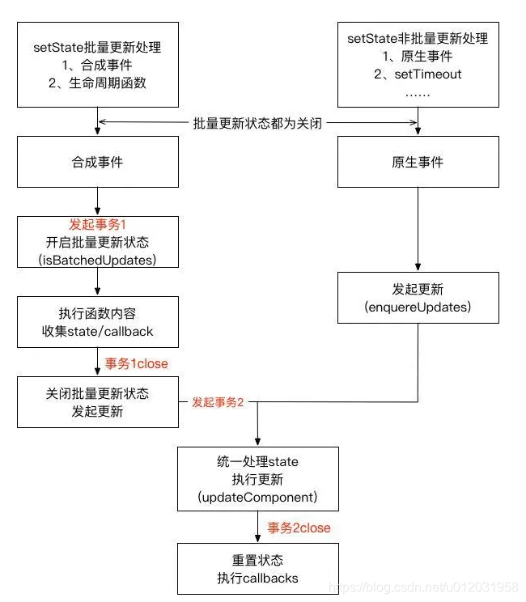

# this.setatate（）的那些事儿

## State的定义
状态（state） 和 属性（props） 类似，都是一个组件所需要的一些数据集合，但是它是私有的，并且由组件本身完全控制，可以认为它是组件的“私有属性（或者是局部属性）”。
定义state时需要考虑是否这个状态值随时会发生改变，如果只是用于渲染或数据流（例如，计时器 ID）则不适合定义在state中。

## State的改变
不要直接更改state的对象值，统一使用setState()。
直接赋值状态值变了，但是不会触发组件重新渲染会导致界面展示的状态值与实际状态值不匹配。

## setState()的用法
书写方式1：this.setstate({},()=>{}) 
书写方式2：this.setstate(()=({}),()=>{})    可以获取到数据更新后的最新值
参数1
1.对象
2.函数
3.null
4.空
3和4会更新状态值但是不会render

## setState合并
当setState() 传对象类型参数，React会合并重复多次的调用setState()，触发一次render；
当setState() 传函数类型参数，React会依次多次的调用setState()，触发一次render。
实例1：
```
// 渲染1
this.setState({
    count: this.state.count + 1
});
this.setState({
    count: this.state.count + 1
}); 
this.setState({
    count: this.state.count + 1
});

// 渲染3
this.setState((state, props) => ({
    count: state.count + 1
}))
this.setState((state, props) => ({
    count: state.count + 1
}))
this.setState((state, props) => ({
    count: state.count + 1
}))
```

## setState是同步的还是异步的？
类组件（class-component）的更新机制--legacy模式
在setTimeout或者原生dom事件中，setState是同步
示例2：
```
setTimeout(() => {
    this.setState({
        count: this.state.count + 1,
        });
        console.log(this.state.count);
}, 0)

const btnEle = document.getElementById('btn');
btnEle.addEventListener('click', () => {
    this.setState({
        count: this.state.count + 1,
    });
    console.log(this.state.count);
});
```

在组件生命周期或React合成事件中，setState是异步
示例3：
```
componentDidMount() {
    this.setState({
        count: this.state.count + 1,
    });
    console.log(this.state.count);
}

onClick() {
    this.setState({
        count: this.state.count + 1,
    });
    console.log(this.state.count);
}
```

原因：
在react生命周期和合成事件执行前后都有相应的钩子，分别是pre钩子和post钩子，pre钩子会调用batchedUpdate方法将isBatchingUpdates变量置为true，开启批量更新，而post钩子会将isBatchingUpdates置为false.在原生事件和异步操作中，不会执行pre钩子，或者生命周期的中的异步操作之前执行了pre钩子，但是pos钩子也在异步操作之前执行完了，isBatchingUpdates必定为false，也就不会进行批量更新。


函数式组件（function-component）的更新机制--concurrent模式
实例4：

```
// 直接调用
    const handleStrightUpdate = () => {
      setCount(1);
      console.log(count); // 0
    };
  
    // 放在setTimeout回调中
    const handleSetTimeoutUpdate = () => {
      setTimeout(() => {
        setCount(1);
        console.log(count); // 0
      });
    };
```

原因：
1，调用 setCount 时，会做合并处理，异步更新该函数式组件对应的 hooks 链表里面的值，然后触发重渲染(re-renders)，与类组件一致；
2，函数式的capture-value特性决定了console.log(count)语句打印的始终是一个只存在于当前帧的常量，所以就算无论 setCount 是不是同步的都会打印出旧值。
capture-value特性: 每次 Render 的内容都会形成一个快照并保留下来，因此当状态变更而 Rerender 时，就形成了 N 个 Render 状态，而每个 Render 状态都拥有自己固定不变的 Props 与 State。



# setState()执行过程
1.调用this.setState(newState)；
2.newState会存入 pending 队列；
     判断是不是batchUpdate；如果是batchUpdate，则将组件先保存在所谓的脏组件dirtyComponents中；如果不是batchUpdate，那么就遍历所有的脏组件，并更新它们。


# setState源码解析(React 15.6.2)
1.enqueueSetState
  将传入的状态值放入数组队列里
  执行enqueueUpdate来更新当前组件的实例

enqueueSetState

2.enqueueUpdate
ensureInjected方法检查当前运行的代码是否处在一个事务（reconcile transaction）中，不是则抛出错误
判断是否处于创建或更新组件阶段：
不是则处理更新事务
是则将推入dirtyComponents数组等待更新。

enquueUpdate
3.batchedUpdates
最开始先把更新标志isBatchingUpdates改为true，
调用transaction.perform(enqueueUpdate)以事务的方式处理updates。

batchedUpdates
3.transaction
来源于面向切面编程，不改变原有方法的基础上，在执行方法的前后进行额外的操作。
wapper1:
FLUSH_BATCHED_UPDATES: 负责执行flushBatchedUpdates更新组件；
wapper2:
RESET_BATCHED_UPDATES: 负责在close阶段把isBatchingUpdates设置为false。


4.flushBatchedUpdates
1.Virtual DOM到真实DOM的映射
2.清空dirtyComponents(一个调用栈作为一个结算节点)并执行runBatchedUpdate方法

 5.runBatchedUpdate
1.先将dirtyComponents排序便于更新是子组件比父组件先更新；
2.循环调用updateComponent更新组件并执行callback。

6.updateComponent
1.计算新的state，更新组件，执行React组件存在期的生命周期方法，完成声明周期的整套流程。


7._processPendingState
如果更新队列为null，那么返回原来的state；
如果更新队列有一个更新值，那么返回更新值；
如果更新队列有多个更新，那么通过for循环将它们合并。


总结 
1. 每次更新组件前后都会执行shouldComponentUpdate,componentWillUpdate，render，componentDidUpdate，所有不能在其声明周期方法中setState(),会引起死循环；
2. shouldComponentUpdate返回false，更新中断 不会执行componentWillUpdate，render，componentDidUpdate，但是state还是会更新；